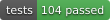

# 非遗动态手势展示系统（DSTE-Net）





> 徽章是 shields.io 的**本地副本**（`docs/badges/`），不直接引用远程 URL——
> 编辑器预览对远程内容有安全限制、或断网时会加载不出来。
> 改版本号后跑 `python tools/fetch_badges.py` 重新拉取即可。

基于 **DSTE-Net**（ResNet-50 + 时空激励模块）的实时动态手势识别桌面应用，用于文化馆非遗展陈：
观众无需接触设备，用手势即可浏览非遗项目、播放介绍视频、查看 3D 展品与地图。

- **界面**：PySide6（含 QtWebEngine 展示 3D / 地图）
- **识别**：IPN-Hand 13 类手势，8 帧 RGB，**纯 CPU 实时推理**
- **交互**：手势驱动页面导航 + 视频快进快退 + 地图平移缩放 + 3D 模型旋转缩放

---

## 目录

| | |
|---|---|
| [一、功能特性](#一功能特性) | 页面 · 手势映射 · 防误触发 |
| [二、快速开始](#二快速开始) | 环境 · 运行 · 资源要求 |
| [三、目录结构](#三目录结构) | |
| [四、素材与生成脚本](#四素材与生成脚本) | 图片 / 模型 / 视频的来源与再生产 |
| [五、模型说明](#五模型说明) | 网络结构 · 权重来源 · 实测耗时 |
| [六、运行机制与调参](#六运行机制与调参) | 防误触三层闸门 · 空闲降频 · 交互区 · 参数速查 |
| [七、测试](#七测试) | |
| [八、打包](#八打包) | PyInstaller（暂未执行） |
| [九、已知限制与待办](#九已知限制与待办) | |
| [十、参考](#十参考) | |

---

## 一、功能特性

### 页面

| 页面 | 内容 |
|---|---|
| 首页 | 6 项非遗卡片轮播、选中高亮、水墨粒子背景 |
| 详情页·主视图 | 作品图**自动轮播**（3.5s，带页码）+ **项目信息卡**（类别/传承人/详实简介）+ 三个功能按钮 |
| 详情页·非遗详情 | 项目介绍（可滚动）+ **介绍视频**（循环播放、可手势快进快退）+ 3 张配图 + **项目二维码**（扫码了解）|
| 3D 交互展示 | three.js(r147) 加载 GLB 模型，自动居中/适配、自转，扁平模型自动侧倾 |
| 传承人风采 | 5 位传承人（视频/照片），上下切换；左/右可快进快退视频 |
| 非遗地图 | 高德瓦片地图，**地名常显**，手势平移 + 缩放 |
| 设置/说明 | 三标签页：手势对照表（按各页真实映射维护）/ 参数调节（现场调参滑条）/ 图片来源 |

### 手势交互（按页面）

| 页面 | 手势 | 动作 |
|---|---|---|
| 首页 | 向左 / 向右抛出 | 上一项 / 下一项（到端点后进入地图 / 传承人）|
| 首页 | 单击 | 进入当前选中项目详情 |
| 详情页·主视图 | 向左 / 向右抛出 | 切换选中按钮（返回主页 / 非遗详情 / 交互展示）|
| 详情页·主视图 | 单击 | 确认（激活选中按钮）|
| 详情页·非遗详情 | 向左 / 向右抛出 | 视频**快退 / 快进 30 秒** |
| 详情页·非遗详情 | 单击 | 返回主视图 |
| 3D 展示 | 张开两次 / 缩小 / 双击 | 放大 / 缩小 / 旋转模型 |
| 3D 展示 | 单击 | 返回 |
| 传承人页 | 向左 / 向右抛出 | 视频快退 / 快进 30 秒 |
| 传承人页 | 向上 / 向下抛出 | 上一位 / 下一位传承人 |
| 传承人页 | 单击 | 返回 |
| 地图页 | 四个方向抛出 | 地图上 / 下 / 左 / 右平移 |
| 地图页 | 张开两次 / 缩小 | 地图放大 / 缩小 |
| 地图页 | 单击 | 返回 |

> 模型共 13 类，映射见 `src/core/gesture_mapper.py`。**未绑定的类别**：单指指向、双指指向、
> 双指点击、双指双击、放大 —— 实测识别偏弱或易混，故意不绑动作，被误判也不会产生动作。
>
> 设置页的手势对照表按各页真实分发逻辑维护，改映射时需同步（真值来源是
> `main_window.MainWindow._ocg`）。

### 防误触发机制

慢模型（单次推理约 0.6s）下要保证"不误触发、不重复触发"，靠的是这几层叠加：

- **显示与触发分离**：显示用即时结果（跟手），触发用平滑结果（稳定）
- **去抖**：连续 2 次识别出同一动作才触发
- **冷却**：触发一次动作后 1.15s 内不响应
- **锁存 + 松手复位**：同一动作触发后锁定，需"松手"（置信度掉下显示门槛）才能再次触发，
  杜绝"举起不放连续翻页"。**锁存跟着"手"走、不跟着页面走**——换页时不清锁，
  否则用户手还停在触发姿势上，残留手势会在新页面上再触发一次
- **锁存兜底 3.5s**：万一置信度一直不降（慢松手），超时自动解锁，避免卡死
- **"已执行"提示**：右上角短暂显示 `✔ 已执行：xx`

---

## 二、快速开始

### 环境

```bash
# 方式一：conda（推荐，本项目开发环境名为 gesture）
conda env create -f environment.yml && conda activate gesture

# 方式二：venv
python -m venv venv && venv\Scripts\activate
pip install -r requirements.txt
```

> 运行依赖已含 Pillow（预处理用）。仅**素材处理脚本**额外需要 **Blender**
> （`fbx_to_glb.py` / `render_slides.py` 使用无头渲染）。

### 运行

```bash
python main.py
```

### 设备与资源要求

| 资源 | 说明 |
|---|---|
| **摄像头** | 默认**自动选择**——有外接摄像头优先用外接，否则用笔记本自带（`config.CAMERA_AUTO_SELECT`）|
| **权重** | `weights/TSQ_ipnhand_RGB_resnet50_shift0.50_blockres_avg_segment8_e50.pth`（**不在版本库中**，见[第五节](#五模型说明)）|
| **视频** | `assets/videos/**`（**不在版本库中**，见[第四节](#四素材与生成脚本)）|
| **3D 模型** | `assets/models/*.glb`（**不在版本库中**，可用脚本生成）|

> 权重文件缺失时程序**不会静默降级**：会弹窗说明并停用手势识别（界面仍可用鼠标操作）。
> 随机初始化的模型照样输出"看着挺像"的置信度，静默错误最难排查。

---

## 三、目录结构

```
dynamic_gesture_system/
├── main.py                     入口（权重不可用时弹窗告警并停用推理）
├── src/
│   ├── config.py               全局配置（模型/推理/手势阈值/摄像头/现场可调项）
│   ├── core/
│   │   ├── camera.py           摄像头采集（自动选外接、掉线自动重连、CLAHE 仅用于预览）
│   │   ├── frame_buffer.py     线程安全帧缓冲
│   │   ├── inference.py        模型加载 + 推理线程（显示/触发双结果、空闲降频、交互区范围）
│   │   ├── gesture_mapper.py   13 类索引 → 控制动作映射
│   │   ├── project_data.py     读取 assets/projects.json
│   │   └── project_assets.py   素材路径解析（图片/模型/视频/二维码/轮播）
│   ├── model/                  DSTE-Net 网络定义（temporal_module 等）
│   └── ui/                     各页面（首页/详情/3D/传承人/地图/设置）+ 摄像头悬浮窗
├── pages/                      viewer.html（3D）、map.html（地图）、three.js / Leaflet
├── docs/badges/                README 顶部徽章的本地副本（由脚本生成，见下）
├── assets/
│   ├── projects.json           6 个非遗项目（名称/级别/类别/传承人/简介/介绍）
│   ├── inheritors.json         传承人页数据（姓名/项目/简介/视频/照片）
│   ├── gestures.json           13 类中文名（悬浮窗显示用）
│   ├── images/<slug>/          卡片图、详情图、传承人配图、二维码、轮播图
│   ├── models/<slug>.glb       3D 模型（脚本生成，未入库）
│   └── videos/                 介绍视频（未入库）
├── tools/
│   ├── prepare_assets.py       从文化馆提供的原始素材生成图片（含裁剪/轮播图）
│   ├── fbx_to_glb.py           Blender 无头 FBX → GLB（归一化尺寸与中心）
│   └── render_slides.py        Blender 渲染 3D 模型 → 轮播图
├── LICENSE                     MIT（仅覆盖代码，范围说明在文件末尾）
├── tests/                      自动化测试（unittest，无需额外依赖）
│   ├── test_gesture_gate.py    去抖/锁存/冷却状态机 + 六页手势路由 + 换页残留手势
│   ├── test_idle_ladder.py     空闲降频阶梯
│   ├── test_interaction_zone.py 交互区与预处理的一致性
│   ├── test_media_idle.py      页面不可见时不得在后台解码视频
│   ├── test_frame_buffer.py    帧缓冲
│   ├── test_gesture_mapper.py  13 类索引与映射
│   ├── test_config_tuning.py   现场调参文件的载入与容错
│   ├── test_data_integrity.py  项目↔素材一致性
│   ├── test_pages_construct.py 页面构造冒烟（含主窗口）
│   ├── check_weights.py        权重结构诊断（手工）
│   └── manual/                 需要摄像头/显示器的交互式冒烟脚本
├── weights/                    模型权重（未入库）
└── environment.yml / requirements.txt
```

---

## 四、素材与生成脚本

素材来自文化馆提供的项目资料，已处理成 `assets/` 下的成品。

> 三个脚本里的源素材路径需按本机实际情况填写（见各脚本顶部常量）；
> 资料目录不在版本库中，脚本仅用于一次性生成，**成品 `assets/` 才是应用的依赖**。

| 脚本 | 作用 |
|---|---|
| `python tools/prepare_assets.py` | 生成卡片图/详情图/传承人配图/二维码/轮播图（支持按图裁剪；原始素材不可用时用仓库内图片兜底）|
| `python tools/fbx_to_glb.py` | 把资料里的 FBX 转成 GLB：烘焙骨骼姿态、居中、统一缩放，供 3D 页加载 |
| `python tools/render_slides.py` | 用 Blender 把 GLB 渲染成轮播图（给缺高清照片的项目）|
| `python tools/fetch_badges.py` | 拉取 README 顶部的徽章到 `docs/badges/`（改了版本号后重跑一次）|

**视频**：资料里的原始视频码率极高（3.9GB），需先转码为 720p/CRF28（约 20~60MB/个）后放入：

- 详情页视频 → `assets/videos/<slug>.mp4`
- 传承人页视频 → `assets/videos/inheritors/<文件名>.mp4`（文件名与 `inheritors.json` 中登记的一致）

### 授权

本仓库的**代码**采用 **MIT**（见 [LICENSE](LICENSE)，正文之后附有范围说明），
但许可范围**不覆盖 `assets/`**：

| 内容 | 权利归属 | 要求 |
|---|---|---|
| `main.py`、`src/`、`tools/`、`tests/` | MIT | 保留版权与许可声明 |
| `assets/`（图片、3D 模型、视频、二维码） | **文化馆原提供方** | 仅授权用于本展示系统；对外使用需另行取得授权 |
| `assets/images/_external/`（包公祠实景照） | Wikimedia Commons，**CC BY-SA 3.0** | **对外展示必须保留署名**，署名与许可见 `assets/images/CREDITS.md` |
| `pages/` 内嵌的 three.js / Leaflet / GLTFLoader | 各自原有许可（MIT / BSD-2-Clause） | 保留其版权声明 |

> 包公祠实景照的署名要求已在设置页 →「图片来源」中呈现（含作者、来源、许可链接与修改说明）。
> **对外展示时不要删掉这一页。**

---

## 五、模型说明

**网络**：ResNet-50 + DSTE 时空激励

- **LSTE**：坐标注意力（`CoordAtt`）+ ECA 动态 3×3 卷积核（`fc1/fc2/bn2`）
- **GSTE**：帧间差分 + 空间自注意力（`SpatialAttention`）
- 时序帧数由权重固定为 **n_segment = 8**（`fc1` 输入维度即 8），**不可随意更改**

**类别**：IPN-Hand **13 类**（B0A…G11），索引顺序已实机验证。

**权重**：`weights/TSQ_ipnhand_RGB_resnet50_shift0.50_blockres_avg_segment8_e50.pth`

- 由服务器训练产出（含 `optimizer`，227MB；只提取 `state_dict` 可缩到 114MB，fp16 约 57MB）
- 训练代码（改进版）在服务器上运行，训练仓库单独维护，**不在本仓库内**
- 训练侧改进：水平翻转 + 方向类标签对调、类别均衡采样、ColorJitter/RandomErasing、
  `load_checkpoint` 兼容 torch≥2.6、`TemporalModule.count` 重置等

**推理后端**：默认 **PyTorch（CPU）**。ONNX Runtime 代码保留但默认关闭
（`config.USE_ONNX=False`：实测该模型含动态分组卷积，ORT 反而比 PyTorch 慢 0.72×）。

**实测耗时**：CPU 单次推理约 **0.5~0.7s**（8 帧）。页面切换的体感延迟靠
"显示/触发分离 + 锁存 + 空闲降频"优化（见[第六节](#六运行机制与调参)）。

---

## 六、运行机制与调参

### 防误触的三层闸门

一次手势从"被识别"到"真的执行动作"，要穿过三道独立的闸门，任何一道不过都不会触发：

```
识别结果 ──► ① 触发门槛  平滑置信度 ≥ CONFIDENCE_THRESHOLD (0.6)
              │
              ├──► ② 去抖 + 冷却  连续 2 次同一动作，且距上次动作已过 ACTION_COOLDOWN_MS (1.15s)
              │
              └──► ③ 锁存  该动作未被锁（松手后才解锁；兜底 MAX_LOCK_MS = 3.5s）
                            │
                            └──► 执行
```

三者职责不同，缺一不可：

| 闸门 | 防的是什么 | 调大 / 调小的代价 |
|---|---|---|
| 触发门槛 | 把"不像手势"的识别结果挡在门外 | 调高更稳但变迟钝；调低更灵敏但易误触发 |
| 去抖 + 冷却 | 一次手势被连读成多次 | 调大更稳但连续操作变卡 |
| 锁存 | 手举着不放被反复触发；**以及换页后残留手势在新页面上再触发** | 调大更稳但"松手后立刻重做"要等更久 |

> ⚠️ 冷却必须**短于**锁存，否则锁存那道闸门永远轮不到生效
> （`tests/test_gesture_gate.py` 里有这条前提的断言）。

### 空闲降频（长时间没手势时降低推理频率）

展台多数时间没人在做手势，而一次推理要几百毫秒，这段算力纯属白烧。判据用
**模型自己的输出**：最近一次 `raw 置信度 ≥ CONFIDENCE_THRESHOLD` 的时刻记为"活跃"，
之后越久没活跃就越降频。

```python
IDLE_LADDER = [
    (0,      20),      # 8s 内有过手势：全速，跟手
    (8000,   300),     # 空闲 8s：最坏多等 0.3s（基本无感）
    (60000,  1000),    # 空闲 60s：空馆，最省；最坏多等 1s
]
```

用模型输出而不是画面帧差，是因为它**不需要标定阈值、不受现场光线与摄像头噪声影响**。
实测支撑：空场景下 raw 置信度中位 0.227、最大 **0.491**，从不达到 0.6；真实手势能过 0.6，
两边分得很开。

> ⚠️ 判据必须用 `CONFIDENCE_THRESHOLD`(0.6)，**不能用 `DISPLAY_CONFIDENCE`(0.35)**——
> 按 0.35 判，空场景有 4%~52% 的采样会被误认成"有手势"，空闲计时永远清零、降频永不触发。

**为什么最深只到 1s**：降得越深，越容易漏掉"访客走过来做的第一个手势"。空闲间隔 1s 时，
一个 1 秒长的手势必然被覆盖；到 5s 就只剩约 20% 命中率。空馆本身没人在乎，但
**"空馆状态下的第一个访客"恰恰是最输不起的那次交互**。

**交互中途停顿不受影响**：阶梯只在 8s / 60s 两个点降档，所以"做完一个手势、停 2~3 秒看结果"
**根本不会离开全速档**；任何一次 `raw ≥ 0.6` 都立刻把空闲计时清零、马上回全速。

档位切换会在终端打日志（`空闲 8 秒，推理间隔 300 ms`），现场可据此确认是否正常降频。
总开关 `config.IDLE_LADDER_ENABLED`。

### 手势交互区（画面里有好几个人怎么办）

模型**只看画面中央一块**：`GroupScale(256)` 把短边缩到 256，再 `CenterCrop(224)` 取中心，
所以画面四周它根本看不到。实测 640×480 下等于中央约 **420×420 像素**（x:109~530, y:29~450）。

预览上会用橙色虚框把这块画出来（`config.CAMERA_SHOW_ZONE`，嫌乱可关掉），并标注
"手势交互区 · 请将手伸入"。**这不是新增约束，只是把已有约束从看不见变成看得见**——
访客一眼就知道该站哪里、手该伸到哪儿。

框的位置由 `inference.model_view_rect()` 从预处理参数算出、不写死，
`tests/test_interaction_zone.py` 用真实预处理管线校验了这层对应关系
（覆盖率 + 标记点坐标映射 + 框外内容不可见），改了预处理参数而忘记同步的话测试会直接报出来。

**多人场景**：路人在画面边缘/背景基本不会被看到；真正麻烦的是两个人同时在中央区域做手势
——系统没有"谁在操作"的概念，会在两种意图之间来回。交互区提示能大幅减少这种情况
（大家会自然排队站到框里）。若现场仍是开放大屏、人流密集，可进一步考虑手部检测仲裁
（只对最大/最近的那只手推理），但那需要引入新依赖并重新验证精度，目前**未做**。

### 调参速查（`src/config.py`）

| 参数 | 作用 | 当前值 |
|---|---|---|
| `NUM_SEGMENTS` | 送入模型的帧数（模型固定）| 8 |
| `SAMPLE_WINDOW_FRAMES` | 从最近多少帧里均匀抽帧（≈0.5s）| 15 |
| `SMOOTH_FRAMES` | 触发判定用最近几次结果平滑 | 2 |
| `CONSISTENCY_COUNT` | 连续几次相同才触发 | 2 |
| `CONFIDENCE_THRESHOLD` | 触发所需置信度 | 0.6 |
| `DISPLAY_CONFIDENCE` | 悬浮窗显示门槛（低于显示"无手势"）| 0.35 |
| `DISPLAY_HOLD_MS` / `DISPLAY_SWITCH_CONFIDENCE` | 显示保持时长 / 抢显示所需置信度 | 1000ms / 0.6 |
| `ACTION_COOLDOWN_MS` | 触发后冷却 | **1150ms** |
| `MAX_LOCK_MS` | 锁存兜底时长（超时自动解锁）| **3500ms** |
| `SEEK_STEP_MS` | 视频快进/快退步长 | 30000 |
| `CAMERA_AUTO_SELECT` | 自动优先外接摄像头 | True |
| `CAMERA_ENHANCE_PREVIEW` / `CAMERA_MIRROR_FEED` | 预览增强（仅显示）/ 喂模型是否镜像 | True / True |
| `CAMERA_SHOW_ZONE` | 预览上画出交互区提示框 | True |
| `IDLE_LADDER` / `IDLE_LADDER_ENABLED` | 空闲降频阶梯（见上）| 开启 |

> 识别偏慢/偏抖时：优先调 `CONFIDENCE_THRESHOLD`、`SMOOTH_FRAMES`、`ACTION_COOLDOWN_MS`。

**其中 6 项可在应用内直接调**：设置页 →「参数调节」，拖动即时生效、**不用改代码重启**。

| 可在界面调整 | 只能改代码 |
|---|---|
| `CONFIDENCE_THRESHOLD`、`DISPLAY_CONFIDENCE`、`CONSISTENCY_COUNT`、<br>`ACTION_COOLDOWN_MS`、`MAX_LOCK_MS`、`DISPLAY_HOLD_MS` | `SMOOTH_FRAMES`（决定平滑缓冲容量，构造时固定）、<br>`NUM_SEGMENTS`、`SAMPLE_WINDOW_FRAMES`、`SEEK_STEP_MS`、`IDLE_LADDER` |

界面改动**默认只临时生效**，点「保存为默认」才写入 `config_local.json`（已 gitignore）——
避免观众误拖后展台参数被永久改坏。该文件被写坏时数值会被夹到合法区间、类型不符则忽略。

---

## 七、测试

```bash
python -m unittest discover -s tests -t .        # 全部：104 个用例
python -m unittest tests.test_gesture_gate -v    # 单个模块
```

标准库 `unittest`，**不需要额外依赖**。GUI 用例通过 `QT_QPA_PLATFORM=offscreen` 离屏运行，
不需要显示器和摄像头。

> 徽章上的 `tests-104` 是写作时的快照；实际数量以 `Ran N tests` 为准。

几处值得一说的测法：

- **`test_gesture_gate.py`（最要紧的一个）**：直接调用真实的 `MainWindow._ocg`，用桩对象充当实例
  （不构造窗口，不起 WebEngine/摄像头）；冷却与锁存的时长靠替换模块内 `time` 做成**可控时钟**
  精确断言，不依赖 `sleep`。其中重放了"首页单击 → 慢松手 → 被弹回首页"这个真实 bug
- **`test_interaction_zone.py`**：拿真实预处理管线反证"画出的交互区和模型实际看到的范围一致"，
  三层判据并用（覆盖率卡画小、标记点卡映射偏移、框外内容卡画大）
- **`test_media_idle.py`**：钉住"页面不可见时不得在后台解码视频"——`QMediaPlayer` 不像网页的
  `requestAnimationFrame` 会随可见性自动停，必须自己管
- **变异验证**：上面几处关键用例都做过"把 bug 改回去，确认测试真的会失败"的验证

交互式冒烟脚本在 `tests/manual/`（需要摄像头/显示器），详见 `tests/README.md`。

---

## 八、打包

> PyInstaller 打包**暂未执行**，以下为估算与注意事项。

- 体积估算：运行时依赖约 1.0GB（PySide6 + torch + OpenCV）+ 素材（图片 5MB、模型 31MB、
  视频约 125MB）→ **约 1.3GB**
  （注：`gesture` 环境实测 1.7GB，其中含各包的 test 套件、头文件与 pip 缓存等不会被打进产物的
  内容；torch 装的是 `+cpu` 版，没有 CUDA 库）
- 需一并打包：`pages/`（three.js、GLTFLoader、leaflet）、`assets/`、`weights/`
- 需收集：QtMultimedia 插件与 FFmpeg 后端 DLL（否则视频无法播放）、QtWebEngine 资源
- `assets/videos/`、`assets/models/`、`weights/` 均在 `.gitignore` 中，打包时需从本地目录取

---

## 九、已知限制与待办

**交付相关**

- **许可范围**：代码为 MIT，但**不覆盖 `assets/`**（版权属文化馆原提供方，其中包公祠实景照为
  CC BY-SA 3.0 需保留署名）。对外分发前请确认素材的使用授权（见[第四节](#四素材与生成脚本)）
- **仓库不自包含**：`weights/`、`assets/models/`、`assets/videos/` 均在 `.gitignore` 中，
  克隆下来直接跑会没有权重、没有模型、没有视频。换机器或交付时需一并拷贝这三个目录
- **打包未做**（见[第八节](#八打包)），展台所需的开机自启与崩溃自拉起也尚未配置

**功能相关**

- **介绍视频待补全**：`assets/videos/` 现只有包公故事、吴山铁字两段（2/6），其余四个项目的
  视频待素材方提供。期间这四个项目进详情页会显示"暂无介绍视频"（用传承人配图充位，布局不变）；
  视频到位后直接放入 `assets/videos/<slug>.mp4` 即可，**无需改代码**
- **二维码仅 4/6**：火笔画、吴山铁字暂无对应二维码；且已有二维码图片上印的是旧名
  "葫芦雕刻"，需文化馆重新出码才能与新名一致
- **多人场景**：见[手势交互区](#手势交互区画面里有好几个人怎么办)一节，未做手部检测仲裁
- **目标机器未定**：推理耗时与 CPU 单核性能强相关（16 线程机器上实测约 0.58s/次），
  交付前建议在候选机器上用 `tests/manual/smoke_inference.py` 实测一次

**待现场确认**

- 两双手同时在画面里时模型的置信度表现（决定要不要做手部检测仲裁）
- 空闲降频与各阈值的最终取值（设置页可现场调，确认后再写入 `config.py`）

---

## 十、参考

- DSTE-Net：Dynamic Spatial-Temporal Excitation Network（本系统采用的时空激励结构）
- TSM: Temporal Shift Module for Efficient Video Understanding — arXiv:1811.08383
- IPN Hand: A Video Dataset and Benchmark for Real-Time Continuous Hand Gesture Recognition —
  <https://github.com/GibranBenitez/IPN-hand>
- 素材与授权：见 `assets/images/CREDITS.md`
